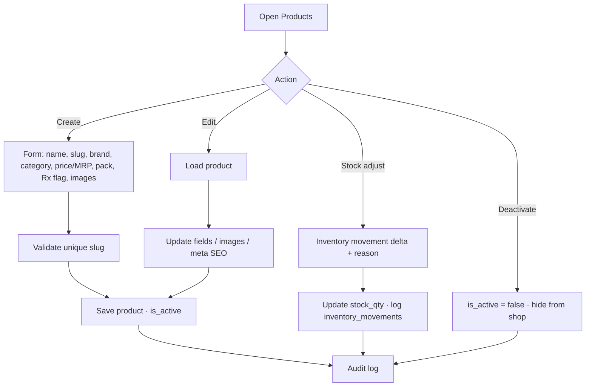
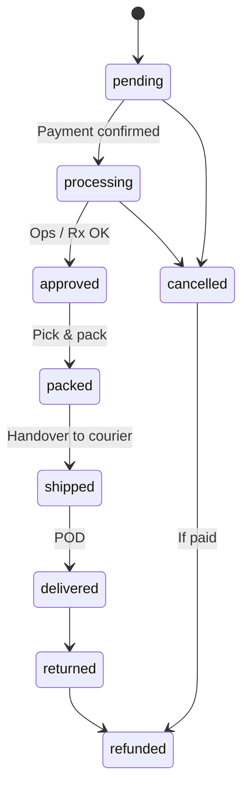
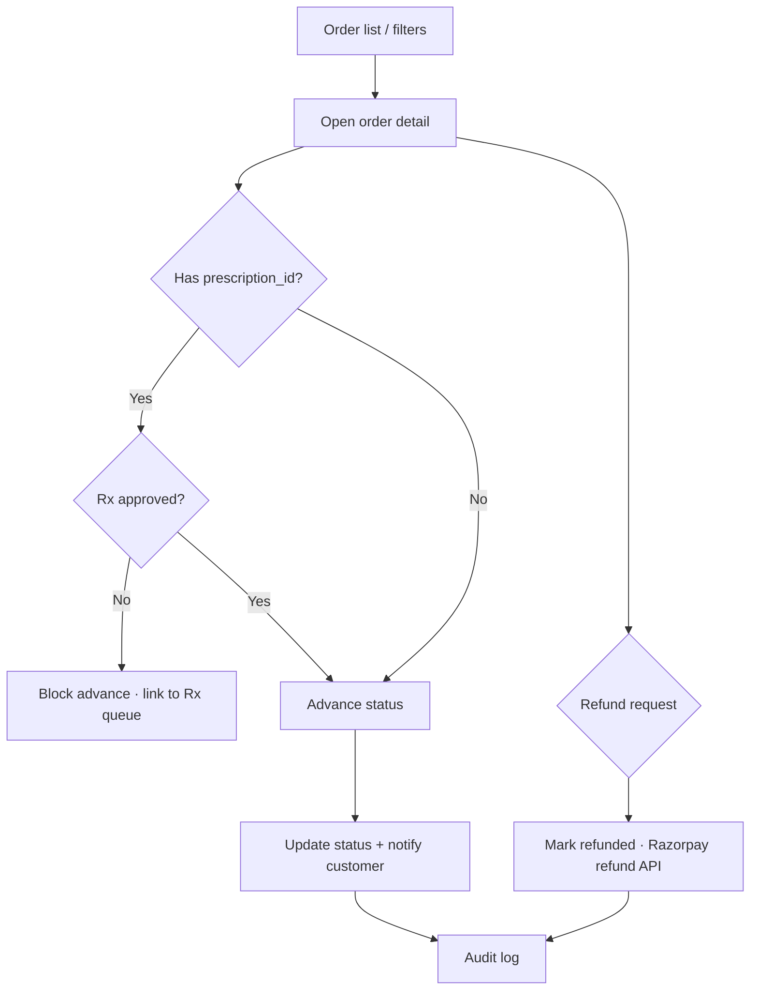
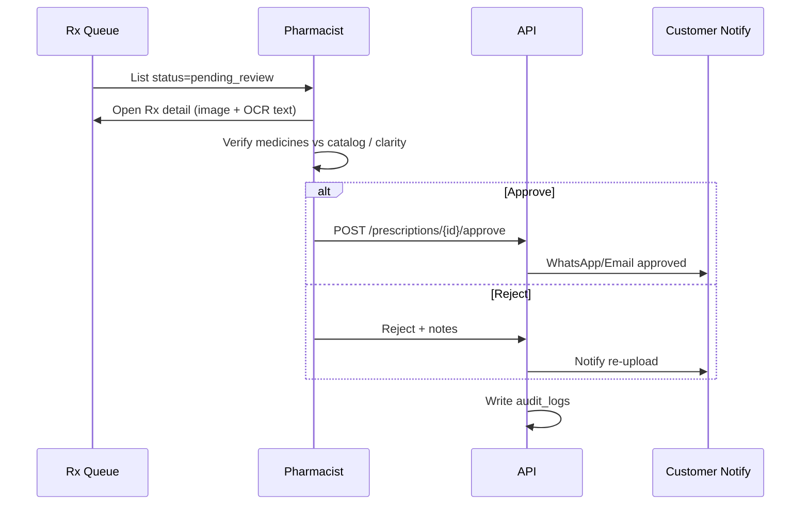
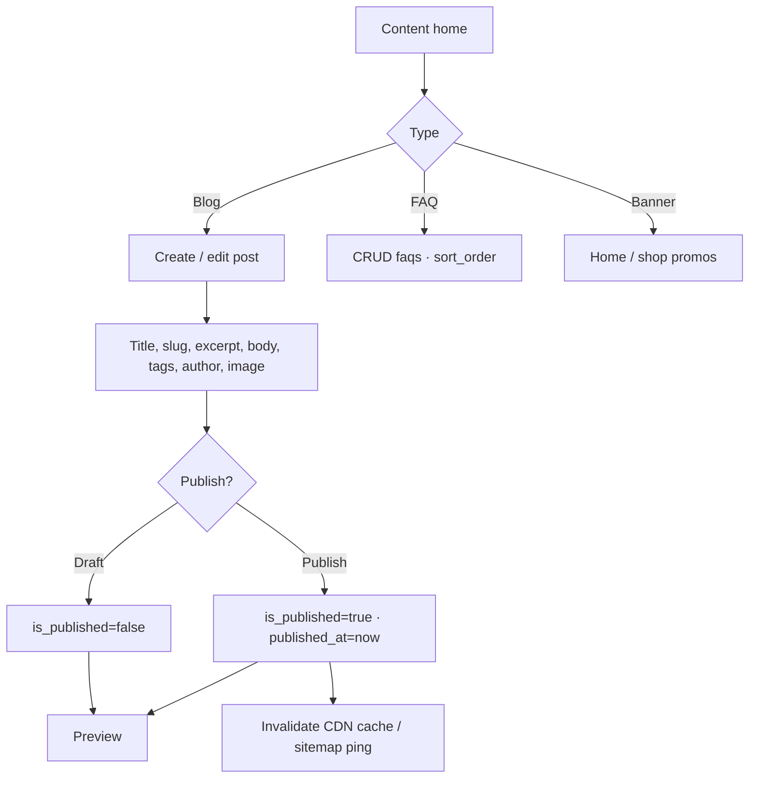
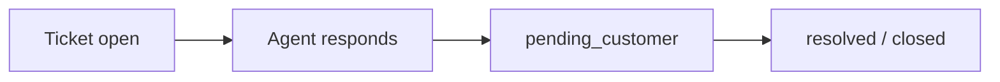
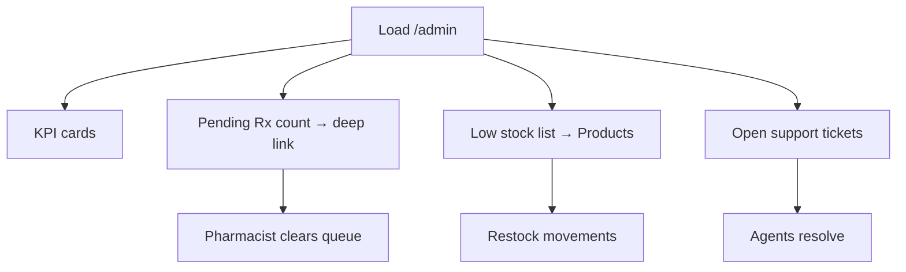

# Admin Flows — Interelia Wellness

Operational journeys for catalog, orders, prescription review, and content CMS. Admin UI lives under `/admin` with RBAC (see `rbac-matrix.md`).

---

## 1. Role entry points

| Role | Primary queues |
|------|----------------|
| `super_admin` | All modules |
| `pharmacist` | Prescriptions, Orders (Rx-related) |
| `content_manager` | Content, SEO |
| `support_agent` | Support, read-only orders |
| `customer` | No admin access |

```mermaid
flowchart LR
  Login[Staff login + JWT role] --> Gate{RBAC}
  Gate -->|allowed| Dash[/admin dashboard]
  Gate -->|denied| 403[Forbidden]
  Dash --> Mod[Module navigation]
```

---

## 2. Product CRUD & inventory

**Actors:** `super_admin` (and catalog-permissioned staff)  
**Screens:** `/admin/products`



### Create checklist

1. Name, unique slug, brand, category  
2. Price, MRP, pack size, stock, low-stock threshold  
3. `requires_prescription` flag  
4. Description, ingredients, usage, warnings, storage  
5. Images → S3 URLs  
6. `meta_title` / `meta_description` for SEO  
7. Publish (`is_active`)

### Inventory rules

- Every stock change writes `inventory_movements` with `created_by`.
- Low stock (`stock_qty ≤ low_stock_threshold`) surfaces on Dashboard.

---

## 3. Order pipeline

**Actors:** `super_admin`, `pharmacist` (limited), `support_agent` (view / limited updates)  
**Screens:** `/admin/orders`

### Status pipeline



### Flow



### Ops steps

1. Filter by status, date, payment_status.  
2. Open order: items, address, payment, linked Rx.  
3. Advance only when prerequisites met (paid + Rx if required).  
4. Enter tracking on `shipped` (courier fields — extend schema as needed).  
5. Support may cancel/refund within policy; always audit.

---

## 4. Prescription review

**Actors:** `pharmacist`, `super_admin`  
**Screens:** `/admin/prescriptions`



### Review checklist

- [ ] Image legible (patient, doctor, medicines, date)  
- [ ] Medicines match OCR / correctable  
- [ ] Items available in catalog or note substitutions policy  
- [ ] No Schedule categories outside license  
- [ ] Approve or reject with clear notes  

### SLA

Target median decision ≤ 4 business hours (see PRD KPIs). Dashboard shows pending count.

---

## 5. Content CMS

**Actors:** `content_manager`, `super_admin`  
**Screens:** `/admin/content` (+ `/admin/seo`)



### Blog publish steps

1. Draft article with Outfit/Plus Jakarta preview in storefront theme.  
2. Set `meta_title`, `meta_description`, category, tags.  
3. Attribution: `author_name`, `author_role`.  
4. Publish → live at `/health/:slug`.  
5. Optional: SEO module updates canonical / redirects.

### Guardrails

- Medical claims review before publish.  
- Soft CTAs only; no unverified cure language.  
- Link to AI disclaimer where health advice appears.

---

## 6. Users & roles

**Screen:** `/admin/users`

1. List customers and staff.  
2. Assign `role_id` (`super_admin`, `pharmacist`, `content_manager`, `support_agent`, `customer`).  
3. Activate/deactivate (`is_active`).  
4. Never expose hashed passwords; reset via secure flow.

---

## 7. Support tickets

**Screen:** `/admin/support`



- Link ticket to `user_id` and optional `order_id` (extend as needed).  
- Macros for Rx wait, delivery delay, refund policy (phase 2).

---

## 8. Analytics & SEO (ops glance)

| Module | Admin actions |
|--------|----------------|
| Analytics | View GMV, conversion, top SKUs, Rx funnel |
| SEO | Edit defaults, trigger sitemap regen, manage redirects |

---

## 9. Audit expectations

Every privileged action should write `audit_logs`:

| action | entity examples |
|--------|-----------------|
| `product.create` / `product.update` | products |
| `order.status_change` | orders |
| `rx.approve` / `rx.reject` | prescriptions |
| `content.publish` | blog_posts |
| `user.role_change` | users |

---

## 10. Dashboard alert loop


