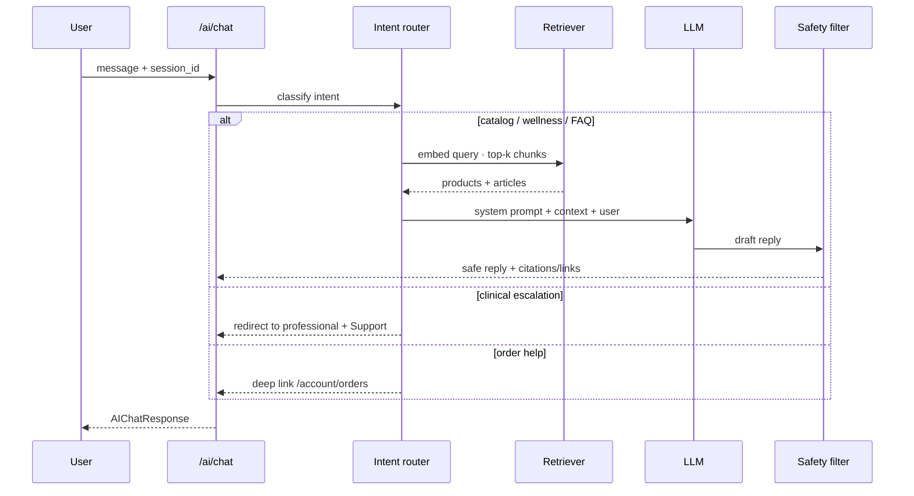
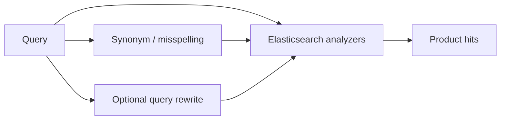
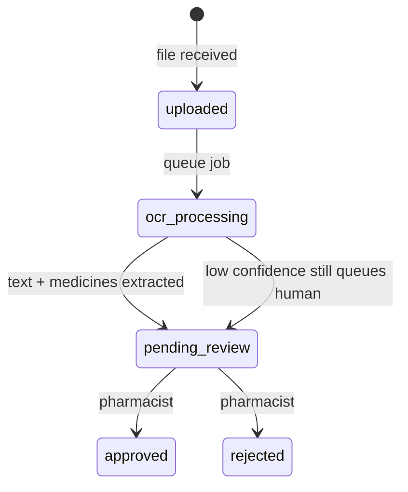

# AI Architecture — Interelia Wellness

Architecture for the AI Health Assistant, intelligent search assist, product recommendations, and prescription OCR pipeline. **AI is assistive and educational — never a substitute for licensed pharmacist approval or clinical diagnosis.**

---

## 1. Principles

1. **Safety first** — Disclaimers in UI; refuse diagnosis/dosage substitution for serious conditions.
2. **Human-in-the-loop for Rx** — OCR extracts; pharmacists approve (`rx.approve`).
3. **Grounding** — Prefer catalog + published Health Hub over free hallucination (RAG in phase 2).
4. **Brand voice** — Clear, calm, Interelia trust; no hype cures.
5. **Observability** — Log prompts/intents (privacy-scrubbed) for quality and abuse monitoring.

---

## 2. System context

```mermaid
flowchart TB
  subgraph Clients
    Widget[AIChatWidget]
    Page[/ai-assistant]
    ShopSearch[Header search]
    AdminRx[Admin Rx queue]
  end

  subgraph API["FastAPI /api/v1"]
    Chat["POST /ai/chat"]
    Recs["GET /ai/recommendations"]
    Upload["POST /prescriptions/upload"]
    Search["GET /products?q="]
  end

  subgraph AI_Services
    NLU[Intent router]
    LLM[LLM provider]
    RAG[Vector retrieval]
    Ranker[Recs ranker]
    OCR[OCR service]
  end

  subgraph Data
    PG[(PostgreSQL)]
    ES[(Elasticsearch)]
    Redis[(Redis)]
    S3[(S3 Rx files)]
    Vec[(Vector store)]
  end

  Widget --> Chat
  Page --> Chat
  ShopSearch --> Search
  Search --> ES
  Chat --> NLU
  NLU --> LLM
  NLU --> RAG
  RAG --> Vec
  Recs --> Ranker
  Ranker --> PG
  Upload --> S3
  Upload --> OCR
  OCR --> PG
  AdminRx --> PG
  LLM --> Redis
```

---

## 3. AI Health Assistant

### Surfaces

| Surface | Path / component | Notes |
|---------|------------------|-------|
| Full page | `/ai-assistant` | Primary immersive chat |
| Widget | `AIChatWidget` in MainLayout | Deferred load |
| API | `POST /api/v1/ai/chat` | Stateless message in; reply out |

### Phase 0/1 (current stub)

Rule-based replies by keyword (prescription, immunity, order track, default). Suitable for demo; swap for LLM without changing contract.

### Phase 2 (production LLM + RAG)



### System prompt constraints (must include)

- Educational only; not diagnosis or prescription.
- Never approve or invent Rx validity.
- Prefer Interelia catalog SKUs when suggesting wellness products.
- Escalate emergencies: advise emergency services, not chat.

### Intents

| Intent | Behavior |
|--------|----------|
| `wellness_info` | Educational + optional product cards |
| `medicine_info` | Label-level info from catalog fields |
| `rx_help` | Link `/prescription` |
| `order_help` | Link account orders / Support |
| `faq` | From `faqs` table |
| `out_of_scope` | Soft refuse + Support / Experts |

---

## 4. Search intelligence

### Today

`GET /products?q=` filters in-memory / SQL `ILIKE` on name/description.

### Target



| Feature | Detail |
|---------|--------|
| Full-text | Name, brand, ingredients, tags |
| Facets | Category, brand, Rx flag, price |
| Synonyms | e.g. “paracetamol” ↔ “acetaminophen” / brand aliases |
| Personalization | Light boost from `ai_recommendations` / purchase history |
| Fallback | Empty results → AI suggest categories |

Search remains deterministic for shop grid; AI rewrite is optional and logged.

---

## 5. Recommendations

### API

`GET /api/v1/ai/recommendations?user_id=`

Returns product slugs + reason string; persist scores in `ai_recommendations`.

### Signals

| Signal | Weighting idea |
|--------|----------------|
| Co-purchase / popular in category | Cold start |
| Brand affinity (Interelia) | Business goal attach rate |
| Seasonality (immunity, etc.) | Rules calendar |
| View / wishlist events | `analytics_events` |
| Exclude OOS / inactive | Hard filter |

### Placement

- Home featured / “For you”
- PDP related row
- AI chat product cards
- Cart cross-sell (non-intrusive)

---

## 6. OCR prescription pipeline



### Pipeline steps

1. **Ingest** — Multipart upload → validate MIME/size → store in S3 (`file_url`).
2. **Queue** — Async worker (Redis/SQS) sets `ocr_processing`.
3. **OCR** — Cloud Vision / Textract / specialty medical OCR → `ocr_text`.
4. **NER / matching** — Extract medicine strings → `extracted_medicines`; fuzzy match catalog SKUs (suggestions only).
5. **Human review** — Pharmacist sees image + OCR + matches; approve/reject with notes.
6. **Notify** — WhatsApp/email customer; unlock Rx checkout when approved.
7. **Audit** — `audit_logs` for every decision.

### Non-negotiables

- No auto-approve based on OCR confidence alone.
- Signed, short-TTL URLs for Rx images.
- RBAC: `rx.read_queue`, `rx.approve`.

---

## 7. Data stores for AI

| Store | Role |
|-------|------|
| PostgreSQL | Source of truth: products, Rx, faqs, blogs, recs rows |
| Elasticsearch | Product search index |
| Vector DB (pgvector / OpenSearch kNN) | Chunk embeddings for RAG |
| Redis | Chat rate limits, session cache, job broker |
| S3 | Rx binaries, optional model artifacts |
| `analytics_events` | Feedback loops |

---

## 8. Safety, privacy, compliance

- Strip PII from LLM logs where possible; never send full Rx images to general LLM without DPA.
- Rate-limit `/ai/chat` per IP/user.
- Abuse detection: prompt injection attempts, prohibited content.
- Align disclaimers with Terms (`/legal/terms`).
- Pharmacist liability boundary documented in ops SOPs.

---

## 9. Evaluation

| Metric | Method |
|--------|--------|
| Thumbs up/down on replies | In-widget feedback |
| Groundedness | Spot-check citations vs catalog |
| Rx OCR field F1 | Medicine name extraction vs pharmacist correction |
| Deflection | Support tickets avoided on FAQ intents |
| Latency | p95 chat < 3s with streaming (phase 2) |

---

## 10. Implementation roadmap

| Phase | Capability |
|-------|------------|
| 0 | Rule-based `/ai/chat`, stub recommendations, simulated OCR |
| 1 | Real OCR + S3 + pharmacist queue; ES search |
| 2 | LLM + RAG over catalog/Health Hub; streaming chat; recs model |
| 3 | Multilingual (Hindi/EN), voice input, refill prediction |

---

## 11. Related APIs & docs

- API: `docs/api/api-specifications.md` (§ AI, Prescriptions)
- User flow: `docs/architecture/user-flows.md` (§ AI, Rx)
- Admin Rx: `docs/architecture/admin-flows.md`
- Deploy: workers on AWS — `docs/architecture/deployment-architecture.md`
