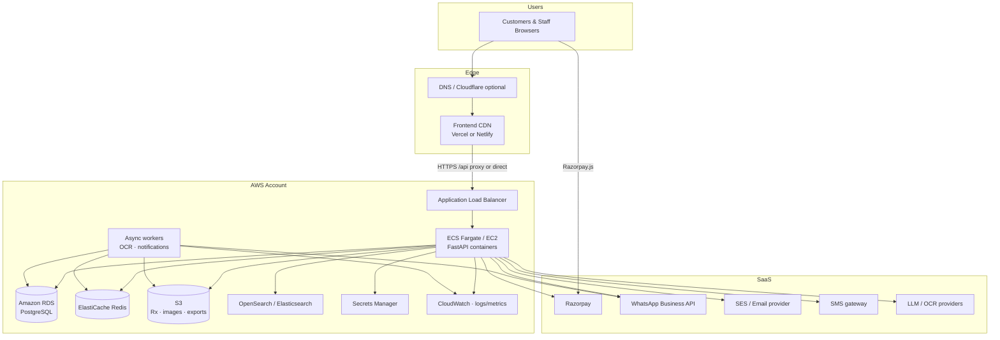
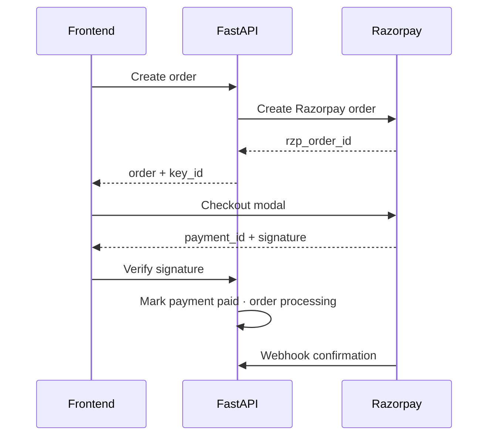
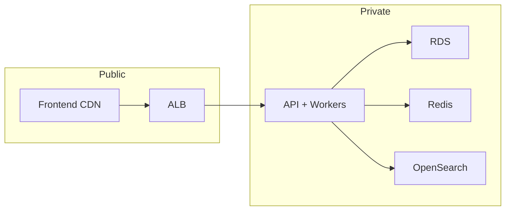

# Deployment Architecture — Interelia Wellness

Production topology for Interelia’s Healthcare Commerce Division: storefront on Vercel or Netlify, API and data plane on AWS, with Redis, S3, Elasticsearch, Razorpay, and WhatsApp integrations.

---

## 1. High-level diagram

---

## 2. Frontend — Vercel / Netlify

| Item | Detail |
|------|--------|
| App | Vite + React storefront + admin SPA |
| Hosting | **Vercel** or **Netlify** (CDN + HTTPS) |
| Domains | e.g. `pharmacy.interelia.com` · preview URLs for PRs |
| Env | `VITE_API_BASE_URL`, `VITE_RAZORPAY_KEY_ID` |
| Headers | Security headers (CSP, HSTS via platform) |
| SSR/prerender | Recommended for SEO money pages (see SEO doc) |

**Deploy flow:** push to `main` → build → atomic deploy → CDN invalidate.

Admin ships in the same bundle at `/admin` with API-enforced RBAC (do not rely on obscurity).

---

## 3. Backend — AWS

| Component | Choice | Purpose |
|-----------|--------|---------|
| Compute | ECS Fargate (preferred) or EC2 ASG | FastAPI `uvicorn`/`gunicorn` |
| LB | ALB + ACM certificate | TLS termination |
| Config | Secrets Manager / SSM | DB URL, JWT, Razorpay secret, S3, WhatsApp tokens |
| CI/CD | GitHub Actions → ECR → ECS rolling deploy | Blue/green optional |
| Scaling | CPU/RPS target tracking | Burst for sales events |

**API base:** `https://api.pharmacy.interelia.com/api/v1`

### Containers

- `api` — HTTP FastAPI  
- `worker` — OCR jobs, email/WhatsApp fanout, search reindex  

---

## 4. PostgreSQL (RDS)

| Setting | Recommendation |
|---------|----------------|
| Engine | PostgreSQL 15+ |
| Topology | Multi-AZ production |
| Schema | Apply `database/schema.sql` + migrations |
| Backups | Automated snapshots + PITR |
| Connectivity | Private subnet; ECS security group only |
| Extensions | `pgcrypto`; consider `pgvector` for RAG |

Never expose RDS publicly.

---

## 5. Redis (ElastiCache)

| Use | Detail |
|-----|--------|
| Session / refresh denylist | JWT logout |
| Rate limiting | `/auth/login`, `/ai/chat` |
| Job queue | OCR & notification brokers (or SQS) |
| Cache | Hot product payloads, FAQ |

---

## 6. Object storage — S3

| Bucket prefix | Contents |
|---------------|----------|
| `rx/` | Prescription uploads (private) |
| `products/` | Catalog images (CDN via CloudFront optional) |
| `exports/` | Analytics / compliance exports |

- Rx objects: SSE-S3 or SSE-KMS, bucket policies, pre-signed GET for authorized roles.
- Lifecycle rules for incomplete multipart uploads.

---

## 7. Elasticsearch / OpenSearch

| Use | Detail |
|-----|--------|
| Index | Products (name, brand, category, ingredients, Rx flag) |
| Sync | On product write → queue reindex |
| Fallback | RDS `ILIKE` if cluster unhealthy |

Hosted: **Amazon OpenSearch Service** in private subnets.

---

## 8. Payments — Razorpay

- Secrets only on server; frontend uses publishable key id.
- Idempotent webhook handler; store `provider_payment_id` on `payments`.

---

## 9. Notifications — WhatsApp, SMS, Email

| Channel | Provider pattern | Events |
|---------|------------------|--------|
| WhatsApp | Meta Cloud API / BSP | Rx status, shipped, reminders |
| SMS | MSG91 / SNS / similar | OTP, delivery alerts |
| Email | Amazon SES | Receipts, Rx decisions, marketing (opt-in) |

Persist attempts in `notifications`; respect user preferences.

---

## 10. Network & security

- WAF on ALB (optional but recommended).
- CORS: allow only storefront origins.
- JWT RS256/HS256 with rotating secrets.
- Least-privilege IAM task roles for S3/SQS/SES.
- Audit CloudTrail + app `audit_logs`.

---

## 11. Environments

| Env | Frontend | API | Data |
|-----|----------|-----|------|
| Local | Vite `:5173` | uvicorn `:8000` | Local Postgres |
| Staging | Preview / staging domain | staging API | RDS snapshot-sized |
| Production | pharmacy.interelia.com | api.pharmacy… | Multi-AZ |

Separate Razorpay test vs live keys; never share prod DB with staging writes.

---

## 12. Observability

| Signal | Tooling |
|--------|---------|
| Logs | CloudWatch Logs (JSON structured) |
| Metrics | Latency, 5xx, queue depth, Rx pending |
| Traces | OpenTelemetry → X-Ray / vendor |
| Uptime | Route 53 health + external ping on `/health` |
| Alerts | Pager on API 5xx, RDS storage, OCR DLQ |

---

## 13. Disaster recovery

| Item | Target |
|------|--------|
| RPO | ≤ 1 hour (RDS PITR) |
| RTO | ≤ 4 hours (redeploy ECS + DNS) |
| Rx files | S3 versioning + cross-region replication optional |
| Runbooks | Payment webhook replay, reindex ES, rotate JWT |

---

## 14. Cost-conscious defaults (MVP)

1. Single-region `ap-south-1` (Mumbai) for India latency.  
2. Fargate small tasks + autoscaling.  
3. Redis small node; upgrade for session scale.  
4. OpenSearch small or defer to RDS search until catalog size demands.  
5. CloudFront in front of S3 product images.

---

## 15. Related docs

- Folder structure: `docs/architecture/folder-structure.md`  
- AI workers: `docs/architecture/ai-architecture.md`  
- API: `docs/api/api-specifications.md`  
- RBAC: `docs/architecture/rbac-matrix.md`

## Separate admin deployment

Interelia Wellness ships a **standalone admin SPA** (`admin/`, port 5174) — not embedded in the storefront.

| Surface | Local URL | Audience |
|---------|-----------|----------|
| Storefront | http://127.0.0.1:5173 | Customers |
| Admin | http://127.0.0.1:5174 | Staff roles only |
| API | http://127.0.0.1:8000 | Shared FastAPI |

Deploy storefront and admin to separate domains; CORS allow both origins. Customer role cannot access admin login.
