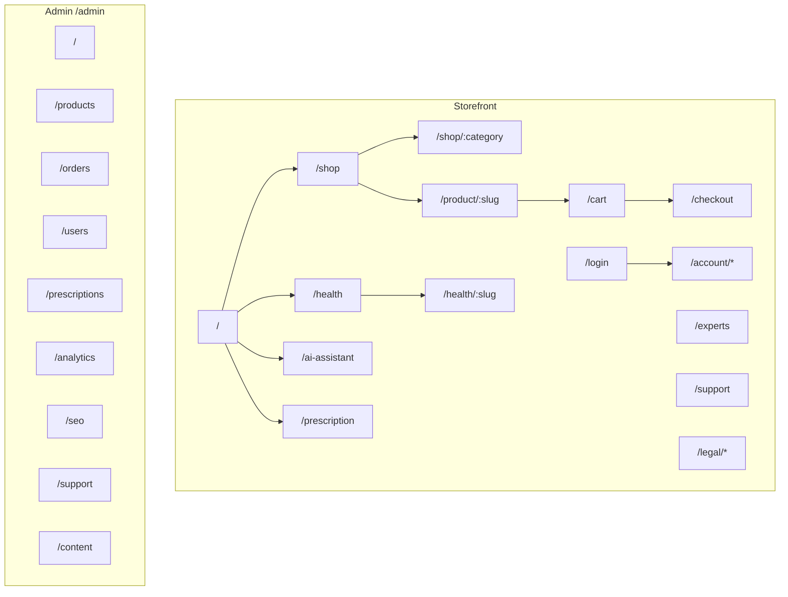

# Information Architecture — Interelia Wellness

**Scope:** Storefront + Admin  
**Brand:** Interelia Healthcare Commerce Division · Parent: [interelia.com](https://interelia.com)

---

## 1. Site map overview



---

## 2. Primary navigation (storefront)

| Label | Route | Notes |
|-------|-------|-------|
| Logo / Home | `/` | Brand wordmark + coral accent |
| Shop | `/shop` | All products |
| Categories | Mega / drawer → `/shop/:category` | medicine, nutrition, wellness, etc. |
| Prescription | `/prescription` | Rx upload funnel |
| AI Assistant | `/ai-assistant` | Full-page assistant |
| Health Hub | `/health` | SEO content |
| Experts | `/experts` | Trust / specialists |
| Support | `/support` | Help center |
| Account | `/account` or `/login` | Auth-aware |
| Cart | `/cart` | Badge count |
| Parent brand | External → interelia.com | Footer + optional header link |

**Utility / secondary**

- Search (header) → results on `/shop?q=`
- Wishlist → `/account/wishlist`
- Mobile: hamburger + bottom bar optional (Shop, Rx, AI, Account, Cart)

---

## 3. Page hierarchy — storefront

### 3.1 Marketing & discovery

| Page | Path | Purpose | Primary CTA |
|------|------|---------|-------------|
| Home | `/` | Brand hero, featured Interelia, categories, trust | Shop / Upload Rx |
| Shop | `/shop` | Catalog grid + filters | PDP / Add to cart |
| Category | `/shop/:category` | Filtered catalog | PDP |
| Product detail | `/product/:slug` | Specs, reviews, Rx gate | Add to cart |
| Health Hub | `/health` | Article index | Read article |
| Article | `/health/:slug` | Long-form SEO content | Shop related / Ask AI |
| Experts | `/experts` | Expert quotes & specialties | Shop / Support |
| Support | `/support` | FAQs, ticket entry | Contact / Account |

### 3.2 Commerce

| Page | Path | Purpose |
|------|------|---------|
| Cart | `/cart` | Line items, coupon, Rx warnings |
| Checkout | `/checkout` | Address, payment (Razorpay), place order |
| Prescription | `/prescription` | Upload → OCR status → review pending |

### 3.3 AI

| Page | Path | Purpose |
|------|------|---------|
| AI Assistant | `/ai-assistant` | Full chat experience |
| Widget | Global (MainLayout) | Persistent assistive entry |

### 3.4 Account

| Page | Path | Purpose |
|------|------|---------|
| Login | `/login` | Auth |
| Dashboard | `/account` | Summary, rewards, quick reorder |
| Orders | `/account/orders` | History + track + reorder |
| Wishlist | `/account/wishlist` | Saved products |
| Prescriptions | `/account/prescriptions` | Upload history |
| Addresses | `/account/addresses` | Shipping book |
| Rewards | `/account/rewards` | Points & subscriptions |
| Notifications | `/account/notifications` | Channel prefs / inbox |
| Support | `/account/support` | Ticket list |

### 3.5 Legal

| Page | Path |
|------|------|
| Privacy | `/legal/privacy` |
| Terms | `/legal/terms` |

---

## 4. Category taxonomy (shop)

```
/shop
├── medicine
├── nutrition
├── wellness
├── personal-care
├── medical-devices
├── mother-child
├── senior-care
├── diabetes-care
├── heart-health
├── ayurveda
└── immunity
```

**URL convention:** `/shop/{category-slug}` · PDP always `/product/{product-slug}` (category-agnostic for stable SEO).

---

## 5. Admin information architecture

**Base path:** `/admin` (separate layout; no storefront chrome)

| Section | Path | Purpose |
|---------|------|---------|
| Dashboard | `/admin` | KPI cards, alerts (low stock, Rx pending) |
| Products | `/admin/products` | Catalog CRUD, stock, Rx flag |
| Orders | `/admin/orders` | Pipeline board / table |
| Users | `/admin/users` | Customers + staff roles |
| Prescriptions | `/admin/prescriptions` | Review queue |
| Analytics | `/admin/analytics` | GMV, conversion, funnels |
| SEO | `/admin/seo` | Meta, sitemap, redirects |
| Support | `/admin/support` | Ticket inbox |
| Content | `/admin/content` | Blogs, FAQs, banners |

### Admin nav order (recommended)

1. Dashboard  
2. Orders  
3. Prescriptions  
4. Products  
5. Content  
6. Users  
7. Support  
8. Analytics  
9. SEO  

---

## 6. Cross-links & deep links

| From | To | Intent |
|------|----|--------|
| PDP Rx badge | `/prescription` | Start Rx for gated SKU |
| Cart Rx warning | `/prescription` | Unblock checkout |
| Health article | `/product/:slug` or `/shop` | Commerce conversion |
| AI reply | Product / Rx / Support deep links | Task completion |
| Account reorder | Cart prefilled | Frictionless repurchase |
| Footer | Legal, Support, interelia.com | Trust & compliance |

---

## 7. Footer IA

```
Shop          Company           Help              Legal
─────         ───────           ────              ─────
All products  About Interelia   Support           Privacy
Categories    Experts           FAQs              Terms
Interelia SKUs Parent site →    Track order       
Upload Rx     Contact           AI Assistant      
```

---

## 8. Search surface map

| Surface | Entry | Lands on |
|---------|-------|----------|
| Header search | Query submit | `/shop?q=` |
| Shop filters | Facets | Same page query params |
| Admin product search | Admin products | Filtered table |
| AI natural language | Chat | Inline answers + product cards |

---

## 9. URL parameter conventions

| Param | Example | Meaning |
|-------|---------|---------|
| `q` | `/shop?q=biotin` | Text search |
| `brand` | `?brand=Interelia` | Brand filter |
| `rx` | `?rx=1` | Prescription-required only |
| `sort` | `?sort=price_asc` | Sort |
| `page` | `?page=2` | Pagination |

---

## 10. Accessibility & structure notes

- One H1 per page aligned with brand/SEO title
- Skip link to main content
- Admin and storefront use distinct layouts to reduce accidental customer access
- Auth-gated routes: `/account/*`, `/checkout` (soft gate OK for browse), `/admin/*` (hard gate + RBAC)
