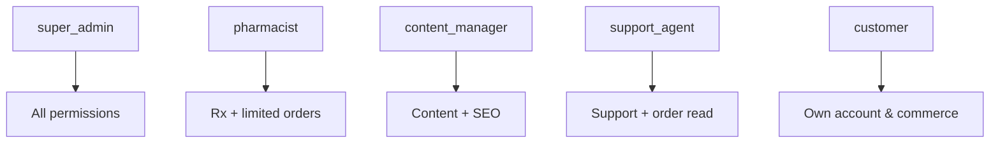

# RBAC Matrix — Interelia Wellness

Role-based access control for storefront and admin APIs. Roles seeded in `database/schema.sql`: `super_admin`, `pharmacist`, `content_manager`, `support_agent`, `customer`.

Permissions live in `permissions` / `role_permissions` and should be enforced on FastAPI dependencies (JWT `role` claim + permission codes).

---

## 1. Roles summary

| Role | Audience | Primary surfaces |
|------|----------|------------------|
| `customer` | Shoppers | Storefront, account |
| `support_agent` | Customer care | Admin support, limited orders |
| `content_manager` | Editorial | Admin content, SEO |
| `pharmacist` | Licensed Rx ops | Admin Rx queue, Rx-linked orders |
| `super_admin` | Platform owners | Full admin + config |



---

## 2. Permission codes (canonical)

| Code | Description |
|------|-------------|
| `catalog.read` | View products (public) |
| `catalog.write` | Create/update products & inventory |
| `order.read_own` | View own orders |
| `order.read_any` | View any order |
| `order.write_status` | Advance/cancel order status |
| `order.refund` | Initiate refunds |
| `rx.upload` | Upload own prescription |
| `rx.read_own` | View own prescriptions |
| `rx.read_queue` | View review queue |
| `rx.approve` | Approve / reject prescriptions |
| `user.read_self` | View own profile |
| `user.read_any` | List users |
| `user.write_roles` | Assign roles / deactivate |
| `content.read` | Read published blogs/FAQs |
| `content.write` | Create/edit/publish content |
| `seo.manage` | SEO tools, redirects, sitemap |
| `analytics.read` | View analytics dashboards |
| `support.read` | View tickets |
| `support.write` | Respond / close tickets |
| `ai.chat` | Use AI assistant |
| `audit.read` | View audit logs |
| `admin.access` | Enter `/admin` shell |

---

## 3. Roles × permissions matrix

Legend: **Y** = allowed · **—** = denied · **O** = own resources only

| Permission | customer | support_agent | content_manager | pharmacist | super_admin |
|------------|:--------:|:-------------:|:---------------:|:----------:|:-----------:|
| `catalog.read` | Y | Y | Y | Y | Y |
| `catalog.write` | — | — | — | — | Y |
| `order.read_own` | Y | Y | — | Y | Y |
| `order.read_any` | — | Y | — | Y | Y |
| `order.write_status` | — | —* | — | Y** | Y |
| `order.refund` | — | —* | — | — | Y |
| `rx.upload` | O | — | — | — | Y |
| `rx.read_own` | O | — | — | — | Y |
| `rx.read_queue` | — | — | — | Y | Y |
| `rx.approve` | — | — | — | Y | Y |
| `user.read_self` | Y | Y | Y | Y | Y |
| `user.read_any` | — | Y | — | — | Y |
| `user.write_roles` | — | — | — | — | Y |
| `content.read` | Y | Y | Y | Y | Y |
| `content.write` | — | — | Y | — | Y |
| `seo.manage` | — | — | Y | — | Y |
| `analytics.read` | — | — | Y*** | Y*** | Y |
| `support.read` | O | Y | — | — | Y |
| `support.write` | O**** | Y | — | — | Y |
| `ai.chat` | Y | Y | Y | Y | Y |
| `audit.read` | — | — | — | — | Y |
| `admin.access` | — | Y | Y | Y | Y |

\* Support may update status only for non-Rx cancellations if policy grants a narrow permission later; default deny.  
\*\* Pharmacist may advance orders that are blocked on Rx verification.  
\*\*\* Optional read-only ops metrics; hide financial PII as needed.  
\*\*\*\* Customer creates tickets; cannot close others’.

---

## 4. Admin UI module access

| Module | customer | support_agent | content_manager | pharmacist | super_admin |
|--------|:--------:|:-------------:|:---------------:|:----------:|:-----------:|
| `/admin` dashboard | — | Y | Y | Y | Y |
| Products | — | — | — | — | Y |
| Orders | — | Y (read) | — | Y | Y |
| Users | — | Y (read) | — | — | Y |
| Prescriptions | — | — | — | Y | Y |
| Analytics | — | — | limited | limited | Y |
| SEO | — | — | Y | — | Y |
| Support | — | Y | — | — | Y |
| Content | — | — | Y | — | Y |

---

## 5. API enforcement sketch

```python
# Pseudocode — FastAPI dependency
def require_permissions(*codes: str):
    def dep(user=Depends(get_current_user)):
        if not user_has_all(user, codes):
            raise HTTPException(403, "Forbidden")
        return user
    return dep

@router.post("/prescriptions/{id}/approve")
def approve(..., user=Depends(require_permissions("rx.approve"))):
    ...
```

- JWT must embed `role` (and optionally permission snapshot).
- Prefer server-side permission lookup for staff role changes without re-login delay (short TTL + Redis cache).

---

## 6. Resource ownership rules

| Resource | Customer rule |
|----------|---------------|
| Orders | `user_id == current_user.id` |
| Prescriptions | Own uploads only |
| Addresses | Own rows only |
| Wishlist / reviews | Own rows only |
| Support tickets | Own tickets; create allowed |

Staff bypass ownership only with `*_any` / queue permissions.

---

## 7. Sensitive data access

| Data | Who can view | Notes |
|------|--------------|-------|
| Rx file images | pharmacist, super_admin, owning customer | Encrypted in transit; S3 signed URLs |
| Payment provider IDs | super_admin, limited support | No raw card data stored |
| PII (phone/email) | self, support, super_admin | Minimize in analytics exports |
| Audit logs | super_admin | Immutable append-only |

---

## 8. Separation of duties

- **AI never holds `rx.approve`.** OCR is assistive only.
- Content managers cannot approve prescriptions or refund orders.
- Pharmacists cannot publish blog content or change roles.
- Super admin actions still write `audit_logs`.

---

## 9. Onboarding staff checklist

1. Create user with staff email  
2. Assign role via `user.write_roles`  
3. Confirm `/admin` access and module visibility  
4. Pharmacist: verify Rx queue + sample approve in staging  
5. Rotate credentials; enable MFA in production (recommended)

---

## 10. Related docs

- Admin flows: `docs/architecture/admin-flows.md`  
- ER roles tables: `docs/database/er-diagram.md`  
- API security: `docs/api/api-specifications.md`
