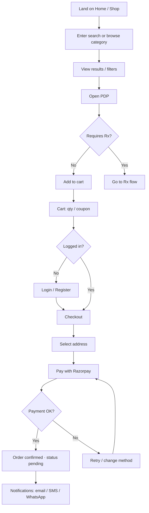
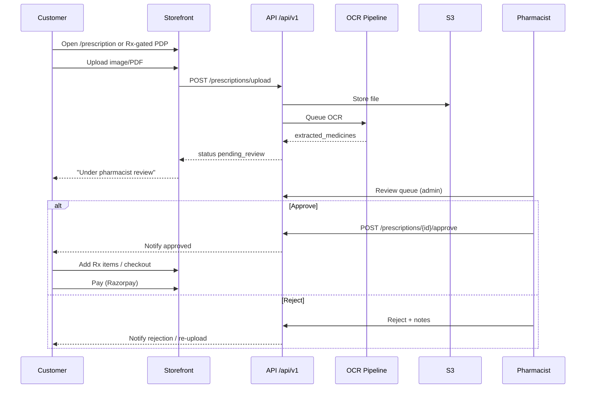
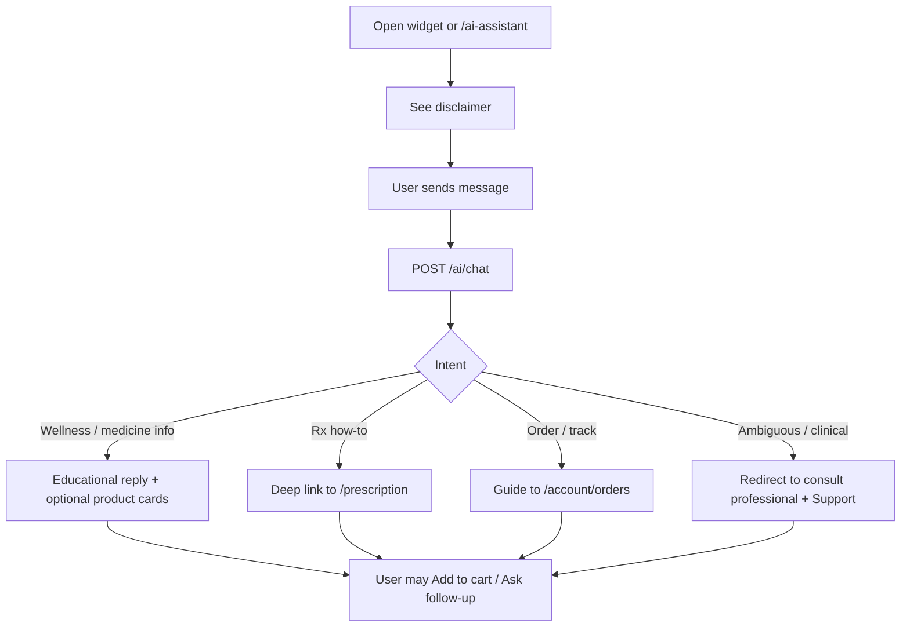
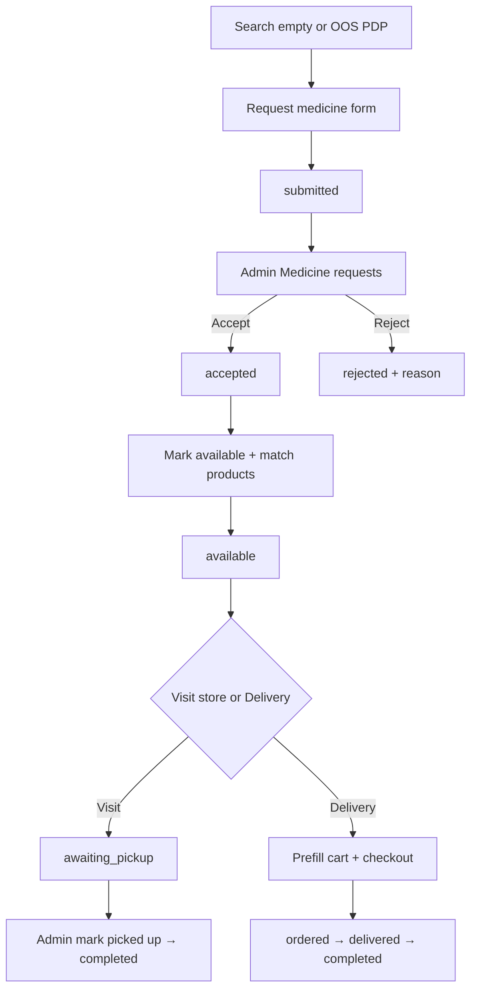

# User Flows — Interelia Wellness

Key customer journeys for storefront commerce, prescriptions, AI assistance, and reorders.

---

## 1. Search → buy (OTC / wellness)

**Actors:** Guest or logged-in customer  
**Goal:** Find a product and complete purchase with Razorpay.



### Steps

1. Customer searches (header) or opens `/shop` / `/shop/:category`.
2. Applies filters (brand, price, stock) as needed.
3. Opens `/product/:slug`, reviews pack, price/MRP, usage.
4. Adds to cart (Zustand cart store); badge updates.
5. Reviews cart; optional coupon.
6. Proceeds to checkout; authenticates if needed.
7. Selects/creates address; confirms totals.
8. Completes Razorpay checkout; backend records payment + order.
9. Lands on confirmation; can track under `/account/orders`.

### Edge cases

- Out of stock → disable CTA, suggest alternatives / AI recommend.
- Coupon invalid → inline error, keep cart.
- Payment abandoned → order remains unpaid/cancelled per webhook rules.

---

## 2. Prescription upload → order

**Actors:** Customer + Pharmacist (async)  
**Goal:** Upload Rx, get pharmacist approval, purchase Rx items.



### Status machine

```
uploaded → ocr_processing → pending_review → approved
                                         ↘ rejected
```

### Steps

1. Customer hits Rx badge on PDP or navigates to `/prescription`.
2. Uploads clear Rx photo/PDF (front of script).
3. System stores file (S3), runs OCR, shows extracted medicine names.
4. Status moves to `pending_review`; customer sees wait messaging.
5. Pharmacist verifies identity of medicines vs catalog and legality.
6. On **approve**: customer notified; can complete cart with Rx SKUs; order links `prescription_id`.
7. On **reject**: notes explain reason; customer may re-upload.

### Rules

- Checkout of `requires_prescription` items blocked without linked `approved` Rx.
- AI must never auto-approve.
- All pharmacist actions audit-logged.

---

## 3. AI Health Assistant chat

**Actors:** Customer (guest OK for educational chat)  
**Goal:** Get educational guidance, find products, or learn how to upload Rx / track orders.



### Guardrails (UX)

- Persistent disclaimer: *Educational only — not a diagnosis or prescription.*
- No dosage instructions that replace clinician advice for serious conditions.
- Prefer catalog + Health Hub facts when RAG is enabled (phase 2).

### Happy path example

1. User: “Suggest immunity support.”
2. Assistant: Vitamin C + Zinc / Multivitamin educational blurb + Interelia SKUs.
3. User taps product → PDP → cart.

---

## 4. Account reorder

**Actors:** Logged-in customer  
**Goal:** Quickly repurchase previous order items.

```mermaid
flowchart TD
  A[Login] --> B[/account or /account/orders]
  B --> C[Select past delivered order]
  C --> D[Reorder]
  D --> E[Prefill cart with available SKUs]
  E --> F{Any Rx items?}
  F -->|Yes| G{Valid approved Rx on file?}
  G -->|No| H[Prompt Rx upload / reuse if policy allows]
  G -->|Yes| I[Proceed to cart]
  F -->|No| I
  H --> I
  I --> J[Checkout → Pay]
  J --> K[New order created]
```

### Steps

1. Customer opens `/account/orders`.
2. Chooses **Reorder** on a past order.
3. System adds in-stock items at current prices (show price-change notice).
4. Skip OOS items with messaging.
5. If Rx-required items present, validate linked/approved prescription per policy.
6. Customer checks cart and completes checkout.

### Rewards touchpoint

- Points earned on paid order; dashboard shows balance (`rewards_points`).

---

## 5. Supporting micro-flows

### 5.1 Wishlist

Browse → heart on ProductCard → `/account/wishlist` → move to cart.

### 5.2 Coupon at cart

Enter code → validate (`coupons` table) → discount on subtotal → checkout.

### 5.3 Guest browse → forced auth

Guest may browse and cart; login required at checkout and for Rx history / reorder.

### 5.4 Medicine requirement list (unavailable brand / medicine)

**Actors:** Customer + Pharmacist / store manager  
**Goal:** Capture demand for medicines not in catalog or out of stock; fulfill via store visit or delivery.



1. Customer opens `/request-medicine` (also from shop empty state / OOS PDP / account).
2. Submits multi-item list (name, brand/company, qty). Status `submitted`; in-app notification created.
3. Staff reviews in admin `/medicine-requests`: accept or reject (with reason).
4. After sourcing, staff matches each line to a catalog product and marks `available`; customer is notified.
5. Customer chooses **Visit store** (`awaiting_pickup`) or **Delivery** (cart prefill → checkout → `attach-order`).
6. Pickup completed by admin; delivery completed when linked order is marked delivered.

---

## 6. Notification touchpoints

| Event | Channels |
|-------|----------|
| Payment success | Email, WhatsApp, SMS |
| Rx approved / rejected | Email, WhatsApp, in-app |
| Medicine request accepted / rejected / available / pickup ready | In-app inbox |
| Shipped + tracking | WhatsApp, SMS |
| Delivered | Email |
| Refill reminder (phase 2) | WhatsApp, push |

---

## 7. Error & recovery summary

| Failure | User recovery |
|---------|---------------|
| Search empty | Suggest categories / AI / **Request this medicine** |
| Upload fail | Retry, format tips |
| OCR low confidence | Pharmacist reviews original image |
| Payment fail | Retry Razorpay |
| Address invalid pincode | Inline validation |
| Session expired | Re-login, cart persisted locally |
| Requested medicine cannot be sourced | Reject with reason in-app |
