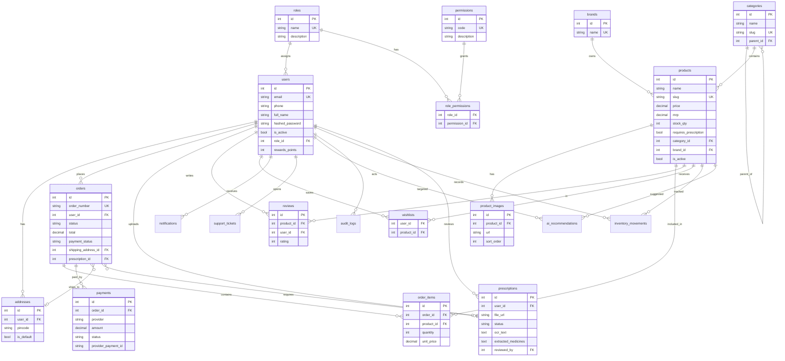
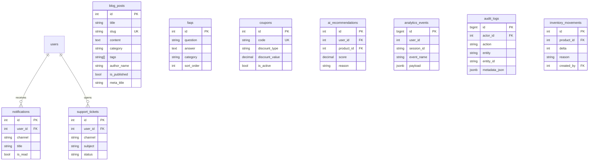

# Entity-Relationship Diagram — Interelia Wellness

PostgreSQL schema aligned with `database/schema.sql`. Diagrams use Mermaid `erDiagram` notation.

---

## 1. Core ER diagram

---

## 2. Content, support & growth entities

---

## 3. Seeded roles

| name | description |
|------|-------------|
| `super_admin` | Full platform access |
| `pharmacist` | Prescription verification & order approval |
| `content_manager` | Blogs, banners, FAQs |
| `support_agent` | Tickets and customer care |
| `customer` | Storefront customer |

---

## 4. Key enumerations (application-level)

### Order `status`

`pending` · `processing` · `approved` · `packed` · `shipped` · `delivered` · `returned` · `cancelled` · `refunded`

### Payment `status`

`pending` · `paid` · `failed` · `refunded`

### Prescription `status`

`uploaded` · `ocr_processing` · `pending_review` · `approved` · `rejected`

### Notification `channel`

`email` · `sms` · `whatsapp` · `push`

### Coupon `discount_type`

`percent` · `flat`

---

## 5. Relationship notes

| Relationship | Cardinality | Notes |
|--------------|-------------|-------|
| User → Orders | 1:N | Customer purchase history |
| Order → Order items | 1:N | Snapshot `unit_price` at purchase |
| Order → Prescription | N:0..1 | Required when cart has Rx SKUs |
| User → Prescriptions | 1:N | Upload history; `reviewed_by` is staff user |
| Category → Category | 1:N | Optional nesting via `parent_id` |
| Product ↔ User (wishlist) | M:N | Composite PK |
| Product ↔ User (reviews) | M:N | Unique `(product_id, user_id)` |

---

## 6. Indexing highlights

- `users(phone)`, `products(name)`, `products(category_id)`
- `orders(status)`, `orders(user_id)`
- `prescriptions(status)`
- `analytics_events(event_name, created_at)`

---

## 7. Future extensions (non-breaking)

- `order_shipments` (courier, AWB, ETA)
- `subscriptions` / auto-refill schedules
- `content_banners` table for CMS promos
- Soft-delete / versioning on `products` and `blog_posts`
